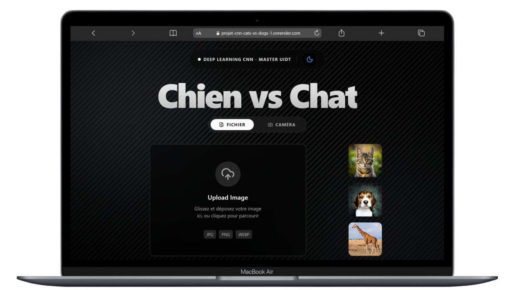

# 🐾 Dogs vs Cats Classifier - AI Deep Learning Project


Une application web moderne et ultra-performante utilisant le Deep Learning pour classifier instantanément les images de chiens et de chats. Ce projet a été développé dans le cadre du projet Deep Learning du **Master 2 GL UIDT**.

---

Disponible ici -> **``` https://projet-cnn-cats-vs-dogs-1.onrender.com/ ```**
---
## 🌟 Fonctionnalités

- **🧠 Deep Learning CNN** : Modèle entraîné sur des milliers d'images pour une précision optimale.
- **📸 Mode Caméra Pro** : Prenez une photo directement depuis votre mobile ou webcam pour une analyse en temps réel.
- **📁 Drag & Drop Intelligent** : Interface fluide pour glisser-déposer vos fichiers images.
- **🖼️ Galerie de Test** : Images d'exemple prêtes à être testées d'un simple clic.
- **🌓 Mode Sombre/Clair** : Interface premium avec glassmorphism et animations fluides.
- **📱 Responsive Design** : Optimisée pour ordinateurs, tablettes et smartphones.

---

## 🛠️ Architecture Technique

### Backend (API IA)
- **Framework** : FastAPI (Python 3.11)
- **Modèle** : Réseau de neurones convolutif (CNN) via TensorFlow/Keras.
- **Prétraitement** : Optimisation des images à la volée avant prédiction.
- **CORS** : Entièrement configuré pour les déploiements multi-origines.

### Frontend (Application Web)
- **Framework** : React 19 + Vite + TypeScript.
- **Styling** : Tailwind CSS 4.0.
- **Animations** : Framer Motion (Transitions fluides et interactives).
- **Composants UI** : Shadcn/UI (Design premium).
- **Caméra** : Intégration robuste avec `react-webcam`.

---

## 🚀 Installation Locale

### 1. Cloner le projet
```bash
git clone https://github.com/CMCode2001/Projet_CNN_cats_vs_dogs.git
cd dogs-cats-classifier
```

### 2. Lancer avec Docker (Recommandé)
Le projet est entièrement conteneurisé. Pour lancer le frontend et le backend simultanément :
```bash
docker-compose up --build
```
L'application sera accessible sur `http://localhost`.

### 3. Installation manuelle (Sans Docker)

**Backend :**
```bash
cd backend
python -m venv venv
source venv/bin/activate  # Sur Windows: venv\Scripts\activate
pip install -r requirements.txt
uvicorn api.api:app --reload
```

**Frontend :**
```bash
cd frontend
npm install
npm run dev
```


---

## 👥 Équipe du Projet
- **Cheikh Mbacke COLY**
- **Bassirou KANE**
- **Mouhamet DIAGNE**

**Cours** : Deep Learning - Master 2 GL UIDT  
**Sujet** : Classification d'images par Réseaux de Neurones Convolutifs (CNN)

---

## 📄 Licence
Ce projet est développé pour un usage éducatif. 

